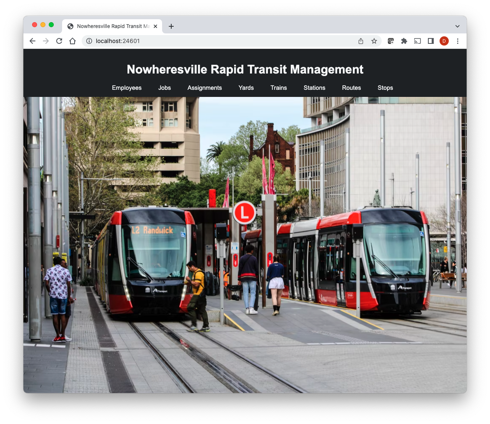
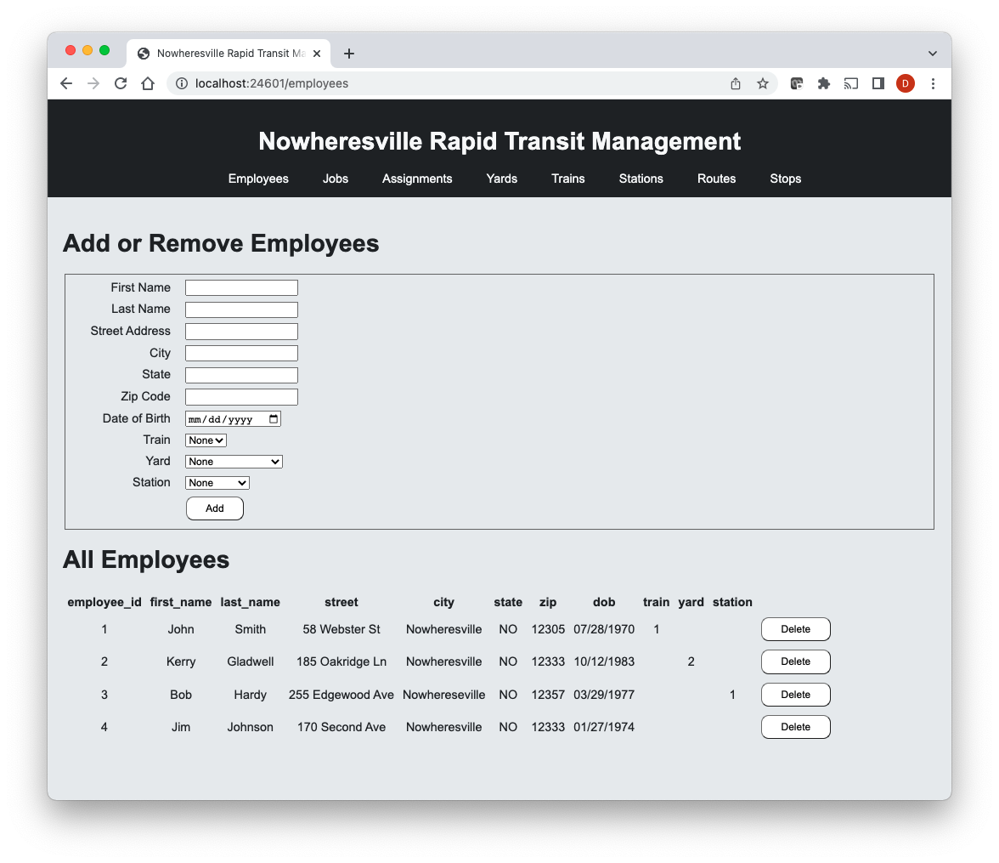
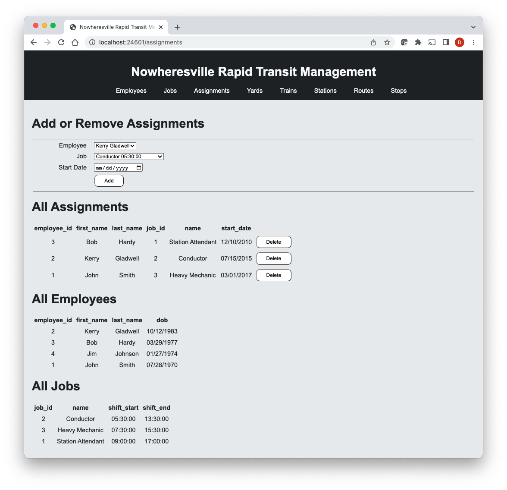

# Nowheresville Rapid Transit Management
MySQL database driven web app using html/css/javascript and node.js/express/handlebars

#

This project was co-written by David Elmer (david.elmer@gmail.com) and Chenliang Wang (wangch9@oregonstate.edu).

Implementation of Employees, Jobs, Assignments, and Yards by David Elmer

Implementation of Trains, Stations, Routes, and Transfers by Chenliang Wang

## Introduction

Nowheresville Rapid Transit Management is a database driven web app for tracking the personnel and assets of the public transit system for the fictitious city Nowheresville.

Nowheresville is a city with a population of 500,000 people. Nowheresville Rapid Transit (NRT) operates 5 routes and 50 stations over 100 miles of track with a fleet of 50 trains. There are 5 yards which are each home to a maintenance shop and storage for off-route trains. Daily ridership on NRT averages 250,000 trips. NRT employs 750 people. The database will contain six entities: Routes, Stations, Trains, Yards, Employees, and Jobs. Two intersection tables--Assignments and Transfers--will represent the many-to-many relationships between Employees/Jobs, and Routes/Stations. The database will record on which of the five Routes or in which of the five Yards a train is located. The database will also record Employees’ details including which Jobs they are currently assigned. The database will be accessed daily by managers from each department--at least one user in asset management and one user in personnel management.

## Implementation

The app is built on the Node.js platform using the Express.js framework and the Handlebars templating engine. The front end is written in HTML, CSS, and Javascript. A MySQL database is used for data access.

**Example implementation: Employees**

The Employees page consists of a form for adding new employees and a table displaying all existing employees. The new employee form has text inputs for First Name, Last Name, Street Address, City, State, and Zip Code; a date input for Date of Birth; and three selects for assigning Trains, Yards, and Stations. The three selects are dynamically populated with data from their respective tables in the database. The table of existing employees also displays a Delete button for each employee.

The Employees page is accessed through the /employees GET route. Express queries the database for all Employees rows to display in a table of existing employees. It also queries the database for the ID and Name of all existing Trains, Yards, and Stations to populate the dropdowns in the form. The page is then rendered using the Handlebars template /views/employees.hbs.

The Javascript file /public/js/employees.js handles submitting form data for new employee entry and deleting existing employees. Event listeners are set up for the form 'Add' button and for each of the employee 'Delete' buttons. 

- The event listener for the 'Add' button calls the insertRequest() function. insertRequest() gathers data from the form, makes an HTTP POST request to the server, and, if the data is successfully added to the database, calls insertRow() and clearForm(). insertRow() takes the inserted data sent back from the server and creates a new row in the table through DOM manipulation. clearForm() resets the form.

- The event listener for the 'Delete' buttons calls the deleteRequest() function. deleteRequest() gathers the ID of the row to be deleted, makes an HTTP DELETE request to the server, and, if the employee is successfully deleted from the database, calls deleteRow(). deleteRow() removes the row element from the table through DOM manipulation.

The global CSS file /public/css/styles.css performs some basic styling.

## Screenshots

Home page:

Employees page - Create or Delete Employees:

Assignments page - Create or Delete Assignments:

